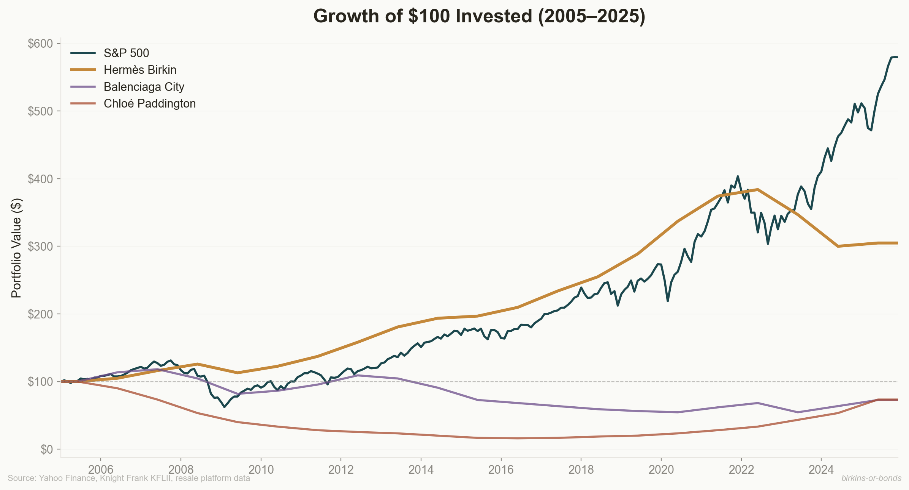
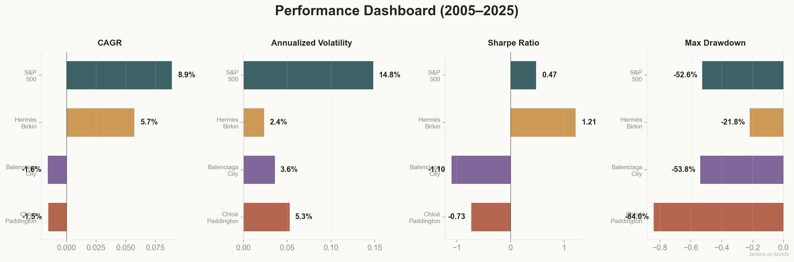
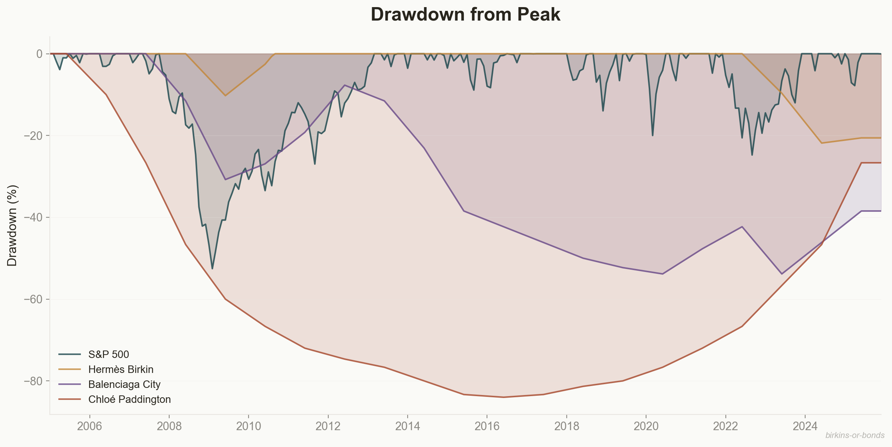
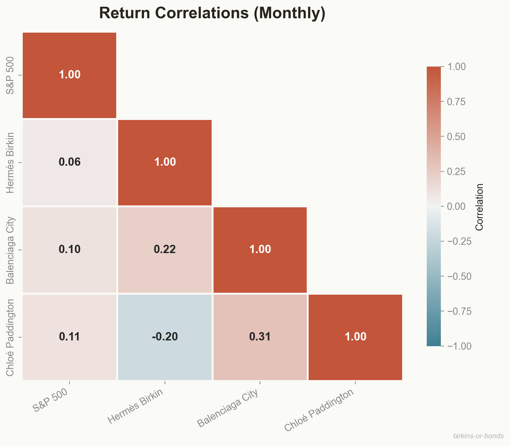
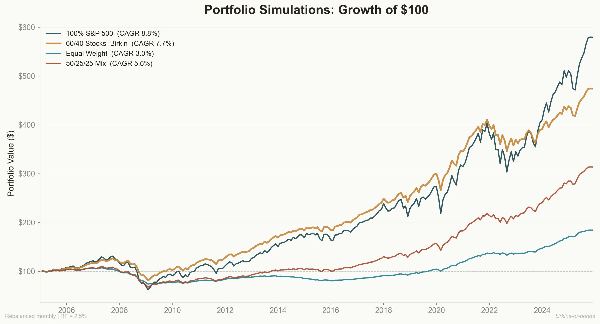
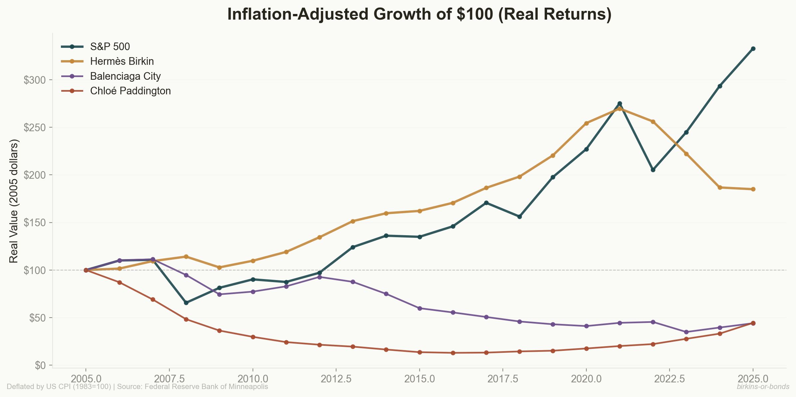

<div align="center">

# 👜 Birkins or Bonds

### An Empirical Analysis of Luxury Handbags as Alternative Investment Assets

*Do Hermès Birkins outperform the S&P 500 on a risk-adjusted basis?*
*Spoiler: it's complicated.*

[](https://python.org)
[](LICENSE)
[](data/)

</div>

---

## The Thesis

In July 2025, Jane Birkin's original Hermès bag sold at Sotheby's Paris for **$10 million** — a 9,900% return on the ~$100,000 paid in 2000. Headlines declared luxury handbags the ultimate alternative investment.

This project subjects that claim to rigorous quantitative analysis, benchmarking three iconic luxury handbag models against the S&P 500 over 20 years (2005–2025):

| Asset | What It Represents |
|-------|-------------------|
| **S&P 500** | Traditional equity markets |
| **Hermès Birkin 35** | The "blue chip" of luxury — scarcity-driven, iconic |
| **Balenciaga City** | The "growth stock" that crashed — trend-driven, volatile |
| **Chloé Paddington** | The "meme stock" arc — hype → crash → nostalgia revival |

---

## Key Findings

<table>
<tr>
<td width="50%">

### 📊 Performance Summary (2005–2025)

| Metric | S&P 500 | Birkin |
|--------|---------|--------|
| **CAGR** | 8.9% | 5.7% |
| **Volatility** | 14.8% | 2.4% |
| **Sharpe Ratio** | 0.47 | **1.21** |
| **Max Drawdown** | −52.6% | −21.8% |
| **Correlation** | — | 0.06 |

</td>
<td width="50%">

### 💡 Key Insights

- **Birkin Sharpe ratio is 2.6× the S&P 500** — not because of higher returns, but because volatility is just 2.4%
- **Near-zero equity correlation (0.06)** — making it a theoretically excellent portfolio diversifier
- **Not all luxury bags appreciate** — Balenciaga and Paddington both lost ~27% over 20 years
- **60/40 stocks–Birkin portfolio** delivers Sharpe 0.60 vs. 0.47 for pure equity

</td>
</tr>
</table>

---

## Visualizations

### Growth of $100 Invested

*The S&P 500 wins on absolute returns ($548 vs. $305), but the Birkin's path is remarkably smooth — it barely registers the 2008 financial crisis.*

### Performance Dashboard


### Drawdown from Peak

*The Paddington's 84% drawdown illustrates the danger of fashion-cycle risk.*

### Correlation Heatmap

*Birkin returns are essentially uncorrelated with equities — driven by scarcity and culture, not economic cycles.*

### Portfolio Simulations

*A 60/40 stocks–Birkin allocation cuts max drawdown from 52.6% to 35.9% while preserving most of the return.*

### Inflation-Adjusted Returns


---

## The Bottom Line

| Question | Answer |
|----------|--------|
| Are Birkins better than bonds? | **Yes** — on a risk-adjusted basis (Sharpe 1.21 vs. ~0.3 for bonds) |
| Are Birkins better than stocks? | **No** — S&P 500 delivers higher absolute returns (8.9% vs. 5.7% CAGR) |
| Are luxury bags good investments? | **Only Hermès** — without artificial scarcity, bags are depreciating goods |
| Should you build a handbag portfolio? | **No** — but the diversification math is real |

---

## Project Structure

```
birkins-or-bonds/
├── README.md
├── requirements.txt
├── LICENSE
├── src/
│   ├── __init__.py
│   ├── main.py              # Full pipeline runner
│   ├── data_collection.py   # Data fetching & proxy construction
│   ├── analysis.py          # Quantitative analysis engine
│   ├── visualizations.py    # Chart generation
│   └── generate_report.py   # PDF report builder
├── data/
│   ├── annual_prices.csv
│   ├── monthly_prices.csv
│   ├── summary_statistics.csv
│   ├── correlation_matrix.csv
│   ├── real_returns_cpi_adjusted.csv
│   └── metadata.json
├── images/                   # All generated charts
├── reports/
│   ├── birkins_or_bonds.qmd  # Quarto source
│   └── birkins_or_bonds_report.pdf
└── notebooks/                # Exploration notebooks
```

---

## How to Run

```bash
# Clone the repository
git clone https://github.com/mariahworkman/birkins-or-bonds.git
cd birkins-or-bonds

# Install dependencies
pip install -r requirements.txt

# Run the full pipeline (data → analysis → charts)
python -m src.main

# Generate the PDF report
python -m src.generate_report
```

---

## Data & Methodology

### S&P 500
Real market data from Yahoo Finance (`^GSPC` index), monthly close prices.

### Luxury Handbags
Proxy time series constructed from:
- **Knight Frank Luxury Investment Index (KFLII)** handbag component — the standard benchmark for collectible handbag returns, compiled by Art Market Research (AMR)
- **Bernstein Research** Secondhand Pricing Tracker — tracks Birkin/Kelly resale premium to retail ratio
- **Auction house records** — Christie's, Sotheby's realized prices for benchmark models
- **Resale platform data** — Fashionphile, Rebag, Vestiaire Collective market benchmarks
- **Retail price histories** — Hermès annual price lists, brand archives

Each data point is documented in `src/data_collection.py` with source attribution.

### Inflation Adjustment
US CPI data from the Federal Reserve Bank of Minneapolis (1983=100 basis).

### Limitations
- **Survivorship bias** — only bags in good condition are resold
- **Illiquidity** — selling takes 2–8 weeks; not reflected in volatility metrics
- **Transaction costs** — 15–30% resale commission not deducted from returns
- **Selection bias** — we track iconic bags, not a random sample
- **No income** — bags pay no dividends; S&P returns exclude dividends for comparability

---

## Analysis Includes

- [x] CAGR (compound annual growth rate)
- [x] Annualized volatility
- [x] Sharpe ratio (RF = 2.5%)
- [x] Maximum drawdown
- [x] Correlation matrix
- [x] Rolling 12-month returns
- [x] Rolling 12-month volatility
- [x] CPI-adjusted (real) returns
- [x] Portfolio simulations (4 allocation strategies)
- [x] Annual returns comparison

---

## Built With

- **pandas** / **numpy** — data processing & numerical computation
- **matplotlib** / **seaborn** — visualization
- **yfinance** — S&P 500 market data
- **scipy** — statistical methods
- **ReportLab** — PDF report generation

---

## License

MIT License — see [LICENSE](LICENSE) for details.

---

<div align="center">
<i>The Birkin is less an investment thesis and more a case study in the economics of scarcity, brand, and cultural permanence.</i>
</div>
